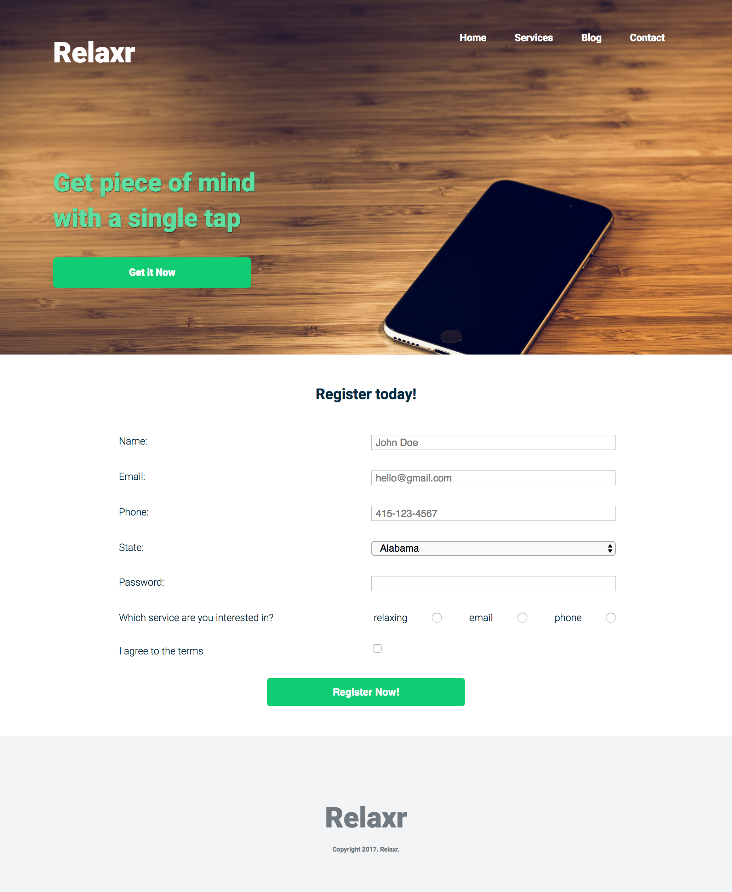
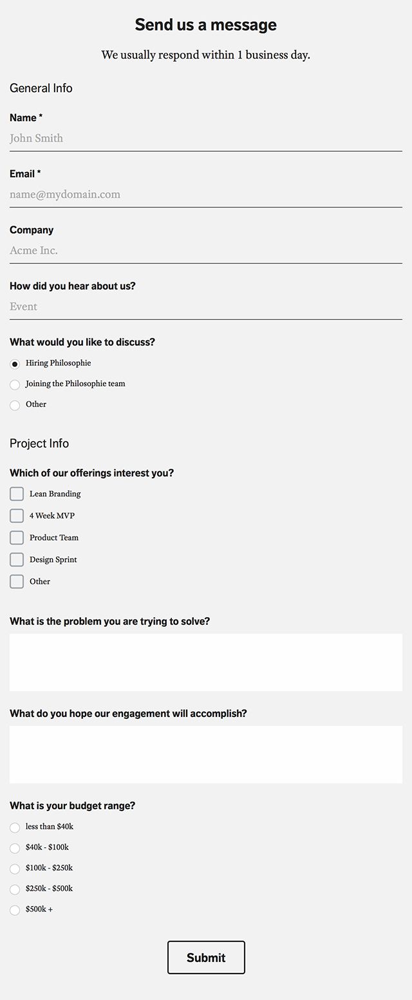

#FEWD Week #8: Forms

---


###Description 

This week, you'll be practicing your form skills: you have the option of adding a form to your final project, finishing the Relaxr form that will be started in class, or building a form for CitiPix. 

The form you build must include at least three different types of HTML form elements and some light CSS styling. 

I'm giving you an example screenshot of a form that renders well on the web and mobile devices, as well as an example, with starter code, of a registration form you could build for Relaxr.

<br>

---


###Real-World Applications

- Be able to apply the proper HTML and CSS styles to create a modern web form
- Revisit applications and projects to iterate on code you've written 


<br>

---


###Technical Requirements 

- Use at least three different types of HTML5 form elements: ```input```, ```textarea```, ```select```, ```radio``` ```button```, ```dropdown```, ```checkbox```
- If using multiple pages on your final, link to your sign-up page from different pages in your application.  If it is a single-page site, try linking to the form on your page using a button and in-page anchor tags 
- Style forms lightly using CSS
- Make sure a user's password is not visible when they are entering it (if this doesn't make sense for your final project, go ahead and put it in your code and leave it commented out until I can review)

####Bonus

- Use responsive media queries to allow for proper rendering on mobile devices 
- Use jQuery and display an error message if any of the input fields are left blank upon submission 
- To replicate application flow, add another page that says "Thanks for Relaxing with us!" after submission


<br>

---

###Resources

- [W3Schools: Form Elements](http://www.w3schools.com/html/html_form_elements.asp)
- [W3Schools: Input Types](http://www.w3schools.com/html/html_form_input_types.asp)
- [MDN: Styling HTML Forms](https://developer.mozilla.org/en-US/docs/Web/Guide/HTML/Forms/Styling_HTML_forms)
- [Webdesign.com: Form Validation with CSS3/HTML5](http://webdesign.tutsplus.com/tutorials/bring-your-forms-up-to-date-with-css3-and-html5-validation--webdesign-4738)
- [CSS-Tricks.com: Tips for Creating Great Web Forms](http://css-tricks.com/tips-for-creating-great-web-forms/)
- [jQuery API Docs: .val( ) function](http://api.jquery.com/val/)

Example forms





<br>

---

###Evaluation / Submission

Depending on the nature of your assignment, please either use their code and repository from a previous project, or create a new folder and repository for their final project. When ready for evaluation, please push your code to the appropriate repository.


I will evaluate against the solution code and your use of technical elements. I  will provide a numeric grade on a scale: does not meet expectations (0); meets expectations (1); exceeds expectations (2). If you decide to build a form as part of your final project, I will be grading it as part of the final project. 

The maximum possible score on this assignment is 10/10. Bonus sections are completely optional.


